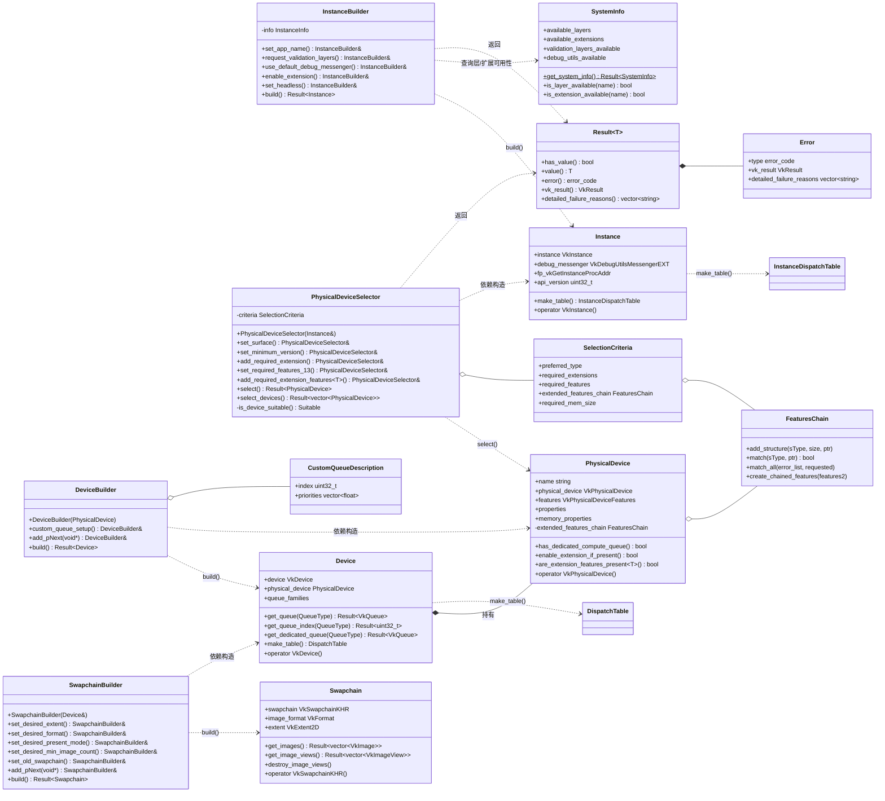

# vk-bootstrap 项目架构分析

> 分析对象：`external/vk-booststrap`（vk-bootstrap，Vulkan 初始化辅助库）

## 一、项目定位与文件结构

vk-bootstrap 是一个 **Vulkan 初始化辅助库**，把约 500 行原生样板代码压缩到约 50 行。它负责 5 件繁琐的事：

**Instance 创建 → PhysicalDevice 选择 → Device 创建 → Queue 获取 → Swapchain 创建**

```
external/vk-booststrap/
├── src/
│   ├── VkBootstrap.h              # 全部公开 API（类声明、错误枚举、Result<T>）
│   ├── VkBootstrap.cpp            # 全部实现（单文件实现，约 2000+ 行）
│   ├── VkBootstrapDispatch.h      # 调度表：InstanceDispatchTable / DispatchTable（脚本生成）
│   ├── VkBootstrapFeatureChain.h  # 特性链 compare/merge 函数声明（脚本生成）
│   └── VkBootstrapFeatureChain.inl
├── gen/                           # 生成 Dispatch/FeatureChain 的 Python 脚本
├── example/                       # basic_usage / triangle / simple_compute / custom_debug_callback / system_info
└── tests/                         # Catch2 单元测试
```

## 二、核心设计模式

| 模式 | 体现 |
|---|---|
| **Builder + 流式接口** | 4 个构建器的方法都返回 `*this&`，链式调用后以 `build()`/`select()` 收尾 |
| **Result\<T\> 错误处理** | `std::variant<T, Error>` 实现类似 Rust 的 Result；5 个错误枚举注册为 `std::is_error_code_enum`，可直接转 `std::error_code` |
| **句柄包装 + 隐式转换** | `vkb::Instance` 等 struct 包装原生句柄并提供 `operator VkInstance()`，可直接传入原生 Vulkan API |
| **手动生命周期** | 非 RAII，用 `destroy_instance/device/swapchain` 自由函数显式销毁，把控制权留给用户 |
| **运行时动态加载** | 不链接 libvulkan，启动时 dlopen 加载 `vkGetInstanceProcAddr`，分派到各级函数指针表 |
| **pNext 特性链抽象** | `detail::FeaturesChain` 用 type-erased 字节数组存储任意 `VkPhysicalDevice*Features` 结构体，支持 add/match/merge/remove |

## 三、类图与类间关系



### 关系要点

1. **线性流水线（建造链）**：`InstanceBuilder → Instance → PhysicalDeviceSelector → PhysicalDevice → DeviceBuilder → Device → SwapchainBuilder → Swapchain`。每个 Builder 消费上一级的产物。
2. **友元封装**：`Instance`/`PhysicalDevice`/`Device`/`Swapchain` 的私有成员通过 `friend class XxxBuilder` 只对构建器开放，用户只能读结果、不能篡改。
3. **FeaturesChain 三处复用**：`PhysicalDeviceSelector::criteria`（请求方）、`PhysicalDevice`（比对+启用方）、`DeviceBuilder::build()` 内部（最终组装进 `VkDeviceCreateInfo.pNext`）。
4. **错误枚举 ↔ 阶段一一对应**：`InstanceError`、`PhysicalDeviceError`、`QueueError`、`DeviceError`、`SwapchainError` 各自对应一个构建阶段，全部汇入 `Result<T>`。

## 四、具体代码示例

### 示例 1：最小完整初始化（对应 `example/basic_usage.cpp`）

```cpp
#include <VkBootstrap.h>
#include <GLFW/glfw3.h>
#include <iostream>

int main() {
    // ---- 1. Instance ----
    vkb::InstanceBuilder inst_builder;
    auto inst_ret = inst_builder.set_app_name("My App")
                        .request_validation_layers()      // 有就启用，没有也不失败
                        .use_default_debug_messenger()    // 默认 debug 回调打印到 stdout
                        .require_api_version(1, 3)        // 要求 Vulkan 1.3
                        .build();
    if (!inst_ret) {
        std::cerr << "Instance 创建失败: " << inst_ret.error().message() << "\n";
        return -1;
    }
    vkb::Instance vkb_inst = inst_ret.value();

    // surface 由窗口库创建（vkb 故意不管窗口）
    glfwInit();
    glfwWindowHint(GLFW_CLIENT_API, GLFW_NO_API);
    GLFWwindow* window = glfwCreateWindow(1280, 720, "vk", nullptr, nullptr);
    VkSurfaceKHR surface;
    glfwCreateWindowSurface(vkb_inst, window, nullptr, &surface); // 隐式转 VkInstance

    // ---- 2. PhysicalDevice ----
    vkb::PhysicalDeviceSelector selector{ vkb_inst };
    auto phys_ret = selector.set_surface(surface)
                        .set_minimum_version(1, 3)
                        .prefer_gpu_device_type(vkb::PreferredDeviceType::discrete)
                        .require_dedicated_transfer_queue()
                        .select();
    if (!phys_ret) {
        std::cerr << "选不到合适的 GPU: " << phys_ret.error().message() << "\n";
        for (auto& reason : phys_ret.detailed_failure_reasons())
            std::cerr << "  - " << reason << "\n";   // 每块 GPU 为什么被拒
        return -1;
    }
    vkb::PhysicalDevice vkb_phys = phys_ret.value();

    // ---- 3. Device + Queue ----
    vkb::DeviceBuilder dev_builder{ vkb_phys };
    auto dev_ret = dev_builder.build();
    if (!dev_ret) { /* ... */ }
    vkb::Device vkb_device = dev_ret.value();

    VkQueue graphics_queue = vkb_device.get_queue(vkb::QueueType::graphics).value();
    uint32_t graphics_family = vkb_device.get_queue_index(vkb::QueueType::graphics).value();

    // ---- 4. Swapchain ----
    vkb::SwapchainBuilder swap_builder{ vkb_device };
    auto swap_ret = swap_builder
                        .set_desired_extent(1280, 720)
                        .set_desired_format({ VK_FORMAT_B8G8R8A8_SRGB, VK_COLOR_SPACE_SRGB_NONLINEAR_KHR })
                        .set_desired_present_mode(VK_PRESENT_MODE_MAILBOX_KHR) // 三缓冲低延迟
                        .set_desired_min_image_count(vkb::SwapchainBuilder::TRIPLE_BUFFERING)
                        .build();
    if (!swap_ret) { /* ... */ }
    vkb::Swapchain vkb_swapchain = swap_ret.value();

    auto images      = vkb_swapchain.get_images().value();
    auto image_views = vkb_swapchain.get_image_views().value();

    // ---- 5. 销毁（严格逆序）----
    vkb_swapchain.destroy_image_views(image_views);
    vkb::destroy_swapchain(vkb_swapchain);
    vkb::destroy_device(vkb_device);
    vkb::destroy_surface(vkb_inst, surface);
    vkb::destroy_instance(vkb_inst);
    glfwDestroyWindow(window);
    glfwTerminate();
}
```

### 示例 2：启用扩展特性（dynamic rendering / synchronization2）

这是 `FeaturesChain` 的实际用法——请求方（Selector）和启用方（PhysicalDevice）通过模板共享同一机制：

```cpp
// 选择阶段：把特性作为"硬性要求"
VkPhysicalDeviceVulkan13Features features13{};
features13.sType = VK_STRUCTURE_TYPE_PHYSICAL_DEVICE_VULKAN_1_3_FEATURES;
features13.dynamicRendering = VK_TRUE;
features13.synchronization2 = VK_TRUE;

vkb::PhysicalDeviceSelector selector{ vkb_inst };
auto phys_ret = selector.set_surface(surface)
                    .set_minimum_version(1, 3)
                    .set_required_features_13(features13)   // 不支持 13 特性的 GPU 直接淘汰
                    .select();

// 选择之后：可选特性"有就启用"，不作为硬性要求
vkb::PhysicalDevice phys = phys_ret.value();
VkPhysicalDeviceShaderDrawParametersFeatures draw_params{};
draw_params.sType = VK_STRUCTURE_TYPE_PHYSICAL_DEVICE_SHADER_DRAW_PARAMETERS_FEATURES;
if (phys.enable_extension_features_if_present(draw_params)) {
    // 已启用；DeviceBuilder::build() 会自动把该结构体挂进 pNext 链
}
// 可选扩展同理：
phys.enable_extension_if_present(VK_KHR_SWAPCHAIN_MUTABLE_FORMAT_EXTENSION_NAME);

vkb::DeviceBuilder dev_builder{ phys };
auto dev_ret = dev_builder.build(); // 所有已确认特性自动组装进 VkDeviceCreateInfo
```

### 示例 3：跳过函数调用开销——使用调度表

```cpp
// 普通方式：vkCmdDraw(...) → 经由 ICD loader 跳板（多一层间接）
// 调度表方式：直接持有驱动函数指针，热路径零开销
vkb::DispatchTable disp = vkb_device.make_table();
disp.createCommandPool(&pool_info, nullptr, &cmd_pool);  // 等价 vkCreateCommandPool
disp.cmdDraw(cmd, 3, 1, 0, 0);                           // 等价 vkCmdDraw

// instance 级函数也有对应表
vkb::InstanceDispatchTable inst_disp = vkb_inst.make_table();
inst_disp.destroySurfaceKHR(surface, nullptr);
```

### 示例 4：无窗口计算（headless，对应 `example/simple_compute.cpp`）

```cpp
vkb::InstanceBuilder builder;
auto inst_ret = builder.set_headless()            // 不加载任何 surface 扩展
                    .set_app_name("compute")
                    .build();
vkb::Instance inst = inst_ret.value();

vkb::PhysicalDeviceSelector selector{ inst };     // 不传 surface
auto phys_ret = selector.require_present(false)   // 不要求显示能力
                    .select();

vkb::Device device = vkb::DeviceBuilder{ phys_ret.value() }.build().value();
VkQueue compute_queue = device.get_queue(vkb::QueueType::compute).value();
```

## 五、一句话总结

vk-bootstrap = **「4 个流式 Builder + Result 错误处理 + pNext 特性链抽象 + 运行时动态加载调度表」**：建造链上的每个 Builder 只依赖上一级的产物 struct，产物通过隐式转换无缝回流入原生 Vulkan API，销毁则由同名 `destroy_*` 自由函数按逆序手动完成。
