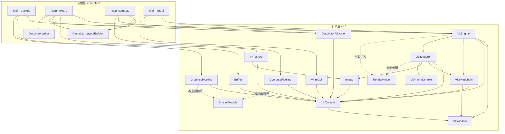

# vk-engine 项目架构、类图与渲染管线

> 分析对象：`src/` 引擎层 + `examples/` 示例层，基于 Vulkan 1.3 动态渲染 + Vulkan-Hpp RAII + vk-bootstrap + VMA + GLFW + GLM + C++20。

## 一、项目分层概览

```
external/  第三方库：vk-bootstrap、glfw、glm、VulkanMemoryAllocator、stb、imgui
shaders/    全局着色器目录（当前为空，示例各自带 shaders/）
src/       vk-engine 静态库（引擎层，14 个头文件 + 13 个实现）
examples/  5 个示例：triangle / texture / compute_clearcolor / imgui / depth(空，未完成)
tests/     3 个测试（C++20，静态断言 + assert）
```

技术底座：**Vulkan 1.3 + Vulkan-Hpp RAII（`vk::raii`）+ vk-bootstrap + VMA + GLFW + GLM + C++20**。
核心架构决策：**动态渲染（dynamic rendering，无 render pass）** + **离屏 draw image**（`R16G16B16A16Sfloat`）→ blit 到 swapchain，双帧在飞（`kFramesInFlight = 2`）。

## 二、类依赖关系图



箭头 = 依赖（引用/组合）。`VkEngine` 是唯一聚合入口，用 `unique_ptr` 按序持有 4 个子系统。

## 三、完整类图（方法 + 成员）

```mermaid
classDiagram
direction LR

class VkWindow {
  -uint32_t width
  -uint32_t height
  -GLFWwindow* window
  -void CreateWindow()
  +VkWindow(uint32_t inWidth, uint32_t inHeight)
  +~VkWindow()
  +GetWidth() uint32_t
  +GetHeight() uint32_t
  +GetWindow() GLFWwindow&
  +ShouldClose() bool
  +ProcessPendingEvents() void
}

class VkContext {
  -const VkWindow& vkWindow
  -vk::raii::Instance instance
  -vk::raii::DebugUtilsMessengerEXT debugMessenger
  -vk::raii::SurfaceKHR surface
  -vk::raii::PhysicalDevice physicalDevice
  -vk::raii::Device device
  -vk::raii::Queue graphicQueue
  -vk::raii::Queue presentQueue
  -uint32_t graphicQueueIndex
  -uint32_t presentQueueIndex
  -VmaAllocator allocator
  +VkContext(const VkWindow& inWindow)
  +~VkContext()
  +GetPhysicalDevice() const vk::raii::PhysicalDevice&
  +GetDevice() const vk::raii::Device&
  +GetSurface() const vk::raii::SurfaceKHR&
  +GetInstance() const vk::raii::Instance&
  +GetGraphicQueue() const vk::raii::Queue&
  +GetPresentQueue() const vk::raii::Queue&
  +GetGraphicQueueFamilyIndex() uint32_t
  +GetPresentQueueFamilyIndex() uint32_t
  +GetAllocator() VmaAllocator
}

class VkSwapchain {
  -const VkContext& context
  -const VkWindow& window
  -vk::raii::SwapchainKHR swapchain
  -vector~vk::Image~ swapchainImages
  -vk::Format format
  -vk::Extent2D extent
  -void Create(VkSwapchainKHR oldSwapchain)
  +VkSwapchain(const VkContext&, const VkWindow&)
  +Recreate() void
  +GetHandle() const vk::raii::SwapchainKHR&
  +GetExtent() vk::Extent2D
  +GetImageFormat() vk::Format
  +GetImageCount() uint32_t
  +GetImages() const vector~vk::Image&~
  +GetImage(uint32_t index) vk::Image
  +HasValidFramebufferExtent() bool
}

class Image {
  -const VkContext* context
  -VkImage image
  -VmaAllocation allocation
  -vk::raii::ImageView imageView
  -vk::Extent2D extent
  -vk::Format format
  -void Create(VkContext&, Extent2D, Format, UsageFlags)
  -void Destroy()
  -void ReleaseOwnership() noexcept
  +Image() default
  +Image(VkContext&, Extent2D, Format, UsageFlags)
  +Image(VkContext&, Extent2D, span~byte~ pixels)  [纹理上传用]
  +~Image()
  +GetHandle() vk::Image
  +GetImageView() vk::ImageView
  +GetExtent() vk::Extent2D
  +GetFormat() vk::Format
}

class Buffer {
  -const VkContext& context
  -VkBuffer buffer
  -VmaAllocation allocation
  -vk::DeviceSize size
  +Buffer(VkContext&, DeviceSize, UsageFlags, MemoryPropertyFlags)
  +~Buffer()
  +Write(span~const byte~ data) void
  +GetHandle() vk::Buffer
}

class VkTexture {
  -const VkContext& context
  -Image image
  -vk::raii::Sampler sampler
  +VkTexture(VkContext&, path)
  +GetDescriptorInfo() vk::DescriptorImageInfo
}

class ShaderModule {
  -vk::raii::ShaderModule module
  +ShaderModule(Device&, path)
  +GetHandle() vk::ShaderModule
}

class DescriptorLayoutBuilder {
  -vector~vk::DescriptorSetLayoutBinding~ bindings
  +AddBinding(binding, type, stageFlags, count=1) DescriptorLayoutBuilder&
  +Clear() void
  +Build(VkContext&) vk::raii::DescriptorSetLayout
}

class DescriptorAllocator {
  -const VkContext& context
  -vector~PoolSizeRatio~ ratios
  -vector~vk::raii::DescriptorPool~ readyPools
  -vector~vk::raii::DescriptorPool~ fullPools
  -uint32_t setsPerPool = 8
  -CreatePool(setCount, ratios) vk::raii::DescriptorPool
  -GetPool() vk::raii::DescriptorPool
  -AllocateFromPool(pool, layout) vk::DescriptorSet
  +DescriptorAllocator(VkContext&)
  +Allocate(layout) vk::DescriptorSet
  +ResetPools() void
}

class DescriptorWriter {
  -deque~vk::DescriptorImageInfo~ imageInfos
  -deque~vk::DescriptorBufferInfo~ bufferInfos
  -vector~vk::WriteDescriptorSet~ writes
  -static CreateWrite(binding, type) vk::WriteDescriptorSet
  +WriteImage(binding, view, sampler, layout, type) DescriptorWriter&
  +WriteBuffer(binding, buffer, size, offset, type) DescriptorWriter&
  +Clear() void
  +Update(VkContext&, set) void
}

class GraphicsPipeline {
  -const VkContext& context
  -GraphicsPipelineDescription description
  -vk::raii::PipelineLayout pipelineLayout
  -vk::raii::Pipeline pipeline
  -vk::Format colorFormat
  -void CreatePipeline(vk::Format)
  +GraphicsPipeline(VkContext&, GraphicsPipelineDescription, Format)
  +EnsureCompatible(colorFormat) void
  +Bind(commandBuffer) void
  +GetLayout() vk::PipelineLayout
}

class ComputePipeline {
  -const VkContext& context
  -ComputePipelineDescription description
  -vk::raii::PipelineLayout pipelineLayout
  -vk::raii::Pipeline pipeline
  +ComputePipeline(VkContext&, ComputePipelineDescription)
  +Bind(commandBuffer) void
  +Dispatch(cmd, gx, gy, gz=1) void
  +GetLayout() vk::PipelineLayout
}

class VkFrameContext {
  +vk::raii::CommandPool commandPool
  +vk::raii::CommandBuffer commandBuffer
  +vk::raii::Semaphore imageAvailable
  +vk::raii::Fence inFlight
  +VkFrameContext(Device&, queueFamilyIndex)
}

class RenderHelper {
  -vk::CommandBuffer commandBuffer
  -vk::Image image
  -vk::ImageView imageView
  -vk::Extent2D extent
  -vk::Format format
  -vk::ImageLayout& currentLayout
  -size_t frameIndex
  -void TransitionTo(newLayout, dstAccess, dstStage)
  +kFramesInFlight = 2 (static constexpr)
  +RenderHelper(cmd, image, view, extent, format, layout&, frameIndex)
  +TransitionToCompute() void
  +TransitionToGraphics() void
  +GetDrawImageView() vk::ImageView
  +GetDrawExtent() vk::Extent2D
  +GetDrawImageFormat() vk::Format
  +GetFrameIndex() size_t
}

class VkRenderer {
  -const VkContext& context
  -VkSwapchain& swapchain
  -Image drawImage
  -vk::ImageLayout drawImageLayout
  -array~VkFrameContext, 2~ frames
  -vector~vk::raii::Semaphore~ renderFinished
  -vector~vk::Fence~ imagesInFlight
  -vector~vk::ImageLayout~ swapchainImageLayouts
  -size_t currentFrame = 0
  -CreateDrawImage() void
  -RecreateSwapchain() void
  -CreateRenderFinishedSemaphores(dev, count)$
  -TransitionImage(cmd, image, oldLayout, newLayout, srcAccess, dstAccess, srcStage, dstStage) void
  -BlitDrawImageToSwapchain(cmd, swapchainImage) void
  +RenderCallback = std::function~void(vk::CommandBuffer, RenderHelper&)~
  +VkRenderer(VkContext&, VkSwapchain&)
  +~VkRenderer() noexcept
  +DrawImageFormat()$ vk::Format
  +DrawFrame(callback) void
  +WaitIdle() void
}

class VkEngine {
  -unique_ptr~VkWindow~ window
  -unique_ptr~VkContext~ context
  -unique_ptr~VkSwapchain~ swapchain
  -unique_ptr~VkRenderer~ renderer
  +VkEngine(width=800, height=600)
  +~VkEngine()
  +Run(const RenderCallback&) void
  +WaitIdle() void
  +GetContext() const VkContext&
  +GetSwapchain() const VkSwapchain&
  +GetDrawImageFormat() vk::Format
  +GetWindowHandle() GLFWwindow&
}

class VkImGui {
  -ImGuiContext* imguiContext
  +VkImGui(VkContext&, GLFWwindow*, Format, minImageCount, imageCount)
  +~VkImGui()
  +BeginFrame() void
  +Render(commandBuffer) void
}

VkEngine *-- VkWindow
VkEngine *-- VkContext
VkEngine *-- VkSwapchain
VkEngine *-- VkRenderer
VkRenderer *-- Image
VkRenderer *-- VkFrameContext
VkRenderer ..> RenderHelper : 每帧构造
VkContext *-- vk::raii::Instance
VkContext *-- vk::raii::Device
VkContext *-- vk::raii::Queue
VkTexture *-- Image
VkTexture *-- vk::raii::Sampler
GraphicsPipeline *-- vk::raii::Pipeline
ComputePipeline *-- vk::raii::Pipeline
```

## 四、各类说明与使用方法

### 1. `VkWindow`（GLFW 窗口）
最底层。`glfwInit` + 创建 `GLFW_NO_API` 窗口。成员：宽高 + 窗口指针。
- `ProcessPendingEvents()` = `glfwPollEvents()`，必须每帧调用（事件输入分发）。
- 示例**不需要直接创建**，由 `VkEngine` 内部持有，通过 `GetWindowHandle()` 取原生指针（给 ImGui 用）。

### 2. `VkContext`（Vulkan 上下文，全局句柄仓库）
用 vk-bootstrap 按序创建：`Instance → DebugMessenger → Surface → PhysicalDevice → Device → Queue(graphic/present)`，最后建 **VMA allocator**（开启 `BUFFER_DEVICE_ADDRESS`）。
- 启用了 Vulkan 1.3 `dynamicRendering` 特性、`bufferDeviceAddress`。
- 所有 RAII 句柄销毁顺序靠**成员声明顺序**保证（`Device` 先析构 → `PhysicalDevice` → `Surface` → `DebugMessenger` → `Instance`）。
- 用法：其余类都通过它拿 `GetDevice()` / `GetGraphicQueue()` / `GetAllocator()` 等。

### 3. `VkSwapchain`
vk-bootstrap 建 swapchain，图像 **usage 只有 `TRANSFER_DST`**（因为引擎不直接画到 swapchain，而是 blit 过去）。持有图像句柄向量、格式、extent。
- `Recreate()`：传旧 swapchain 句柄重建（窗口 resize 时）。
- `HasValidFramebufferExtent()`：最小化时 framebuffer 为 0，重建前先检查。

### 4. `Image`（可移动的 VMA 图像 RAII）
- `Create()`：`vmaCreateImage` + 创建 image view，`DEVICE_LOCAL` 内存。
- 纹理构造重载：`Image(context, extent, pixels)` 内部做 **staging buffer → 单次提交拷贝 → fence 等待** 的上传，结束态 `eShaderReadOnlyOptimal`。
- 支持 move 语义（`ReleaseOwnership` 防 double-free），不可拷贝。

### 5. `Buffer`
VMA 缓冲。`memoryProperties` 决定内存类型；`HostVisible` 时自动加 `MAPPED_BIT`。
- `Write(span<byte>)`：映射 + memcpy。顶点/索引/UBO 都可用。

### 6. `VkTexture`
`stb_image` 解码（强制 4 通道）→ `Image` 上传 → 创建线性采样器。
- `GetDescriptorInfo()` 返回可直接写入 descriptor 的 `DescriptorImageInfo`（layout 已固定为 `eShaderReadOnlyOptimal`）。

### 7. `ShaderModule` + 自由函数
- `ShaderPath()`：返回 `shaders/xxx.spv`（由 CMake 宏 `VK_ENGINE_SHADER_DIR` 覆盖为构建目录）。
- `ReadSpirvFile()`：读文件 + 校验 SPIR-V magic、4 字节对齐，失败抛异常。
- `ShaderModule`：仅用于管线构造期，RAII 包装 `vk::ShaderModule`。

### 8. Descriptor 三件套（vkguide 风格）
- `DescriptorLayoutBuilder`：链式 `AddBinding` → `Build()` 出 layout。
- `DescriptorAllocator`：池式分配，按比例预置 6 种 descriptor 类型；池满自动翻倍（最多 4096 sets），失败时把满池挪到 `fullPools` 再开新池。`ResetPools()` 每帧可复用。
- `DescriptorWriter`：累积 `WriteImage/WriteBuffer` → `Update()` 一次性 `updateDescriptorSets`。`std::deque` 存储 `DescriptorImageInfo/BufferInfo` 保证指针在 `updateDescriptorSets` 前有效。

### 9. `GraphicsPipeline` / `ComputePipeline` + 描述结构体
- 描述结构体：`VertexInputDescription`、`PipelineLayoutDescription`、`GraphicsPipelineDescription`（默认三角形拓扑/填充/CCW/不剔除/无深度/无混合）、`ComputePipelineDescription`。
- `GraphicsPipeline::CreatePipeline()`：装配完整图形管线，关键点：**动态渲染**（`vk::PipelineRenderingCreateInfo` 设 color attachment 格式，`setRenderPass(nullptr)`）、viewport/scissor 为**动态状态**（因此每帧可改）、blend 描述按 `blendEnable` 切换（ImGui 管线需 alpha blend）。
- `EnsureCompatible(colorFormat)`：draw image 格式变化时自动重建管线（构造时用 swapchain 格式，渲染时用 draw image 的 R16G16B16A16Sfloat）。
- 用法：示例在回调内 `pipeline.Bind(cmd)` + `commandBuffer.bindDescriptorSets(...)`。

### 10. `VkFrameContext`（每帧资源）
一个在飞帧 = commandPool + commandBuffer + `imageAvailable` 信号量 + `inFlight` 围栏。声明顺序保证 commandBuffer 先于 commandPool 销毁。

### 11. `RenderHelper`（回调面 - 每帧临时对象）
`VkRenderer::DrawFrame` 构造后传给用户回调，封装 draw image 状态：
- `TransitionToGraphics()` / `TransitionToCompute()`：自动记录 layout barrier（`eUndefined` 初始时无源同步，非 undefined 时按当前 layout 推导源 access/stage）。
- `GetDrawImageView()/Extent/Format/FrameIndex()`：回调内查询。

### 12. `VkRenderer`（核心渲染器）
- `RenderCallback = std::function<void(vk::CommandBuffer, RenderHelper&)>`：用户的绘制入口。
- `DrawFrame()`：完整帧流程（见第五节）。
- `WaitIdle()`、`DrawImageFormat()` 静态方法。

### 13. `VkEngine`（引擎门面）
聚合 4 子系统，`Run(RenderCallback)` 驱动主循环。示例只需 `VkEngine engine{}; engine.Run([&](cmd, helper){...})`。

### 14. `VkImGui`（ImGui overlay）
`BeginFrame()`（CPU：处理输入+新帧，须在 `glfwPollEvents` 之后、`Render` 之前）、`Render(cmd)`（在 `beginRendering`/`endRendering` 之间录制 UI 绘制）。动态渲染路径：`UseDynamicRendering` + `PipelineRenderingCreateInfo`。使用方式见 texture/imgui 示例。

### 15. 工具
- `VK_CHECK(call)`：包 `source_location` 的 VkResult 检查，失败抛 `std::runtime_error`。
- `vk_vma.h`：仅统一包含 `vk_mem_alloc.h`。

## 五、完整图形管线流程

### A. 初始化阶段（`VkEngine` 构造 + 示例 setup）

```
VkWindow     glfwInit → glfwCreateWindow(NO_API, resizable)
   │
VkContext    InstanceBuilder(1.3, validation, debug msg)
   │           → Surface(glfwCreateWindowSurface)
   │           → PhysicalDeviceSelector(要求 dynamicRendering / bufferDeviceAddress)
   │           → DeviceBuilder
   │           → graphicQueue/presentQueue
   │           → VMA allocator(BUFFER_DEVICE_ADDRESS)
   │
VkSwapchain  SwapchainBuilder(desired extent, image usage = TRANSFER_DST)
   │
VkRenderer   CreateDrawImage(R16G16B16A16Sfloat, COLOR_ATTACH|TRANSFER_SRC|SAMPLED|STORAGE)
   │            创建 2× VkFrameContext + renderFinished[imageCount] 信号量
   │
示例层       Buffer(顶点/索引) → Write()
   │          VkTexture(stbi → Image 上传)  |  DescriptorLayoutBuilder → Allocator.Allocate
   │          DescriptorWriter.Update()     |  GraphicsPipeline / ComputePipeline
   └─ VkImGui(可选)：GLFW+Vulkan 后端初始化
```

### B. 每帧渲染（`VkEngine::Run` 主循环）

```
while (!window.ShouldClose())
    ┌─ 1. VkWindow::ProcessPendingEvents()  ← glfwPollEvents（更新输入/窗口事件）
    │
    └─ VkRenderer::DrawFrame(callback)
         │
         │  (a) 等待帧同步
         │      waitForFences(frames[currentFrame].inFlight)      ← 等上一轮此帧槽完成
         │      acquireNextImage(∞, imageAvailable)                ← 拿一张 swapchain 图像
         │          ├─ eSuboptimalKHR → 标记重建
         │          └─ OutOfDateKHR   → RecreateSwapchain() + return（本帧跳过）
         │      imagesInFlight[imageIndex] 非空则等待其 fence    （防同一图像被两帧使用）
         │
         │  (b) 录制命令
         │      commandPool.reset(); commandBuffer.begin(OneTimeSubmit)
         │      RenderHelper helper(...)  ← 携带 draw image 视图/格式/layout/帧号
         │
         │      ┌── 用户回调 callback(commandBuffer, helper) ──┐
         │      │ 1. TransitionToGraphics()/TransitionToCompute()│  ← draw image layout barrier
         │      │ 2. beginRendering(renderArea=全幅, colorAttachment=draw image view,
         │      │                      load=Clear, store=Store)
         │      │ 3. 示例绘制：
         │      │    graphics: Bind → setViewport → setScissor → bindDescriptorSets
         │      │              → bindVertexBuffers/bindIndexBuffer → draw/drawIndexed
         │      │    compute : Bind → bindDescriptorSets → Dispatch(w/16, h/16)
         │      │ 4. (可选) imgui.Render(cmd)   ← 必须在 begin/endRendering 之间
         │      │ 5. endRendering()
         │      └─────────────────────────────────────────────┘
         │
         │  (c) draw image → swapchain 传输
         │      Transition(drawImage: ??? → TRANSFER_SRC, 源 access 按当前 layout 推导)
         │      Transition(swapchainImg: 记录态 → TRANSFER_DST)
         │      BlitDrawImageToSwapchain(drawImage → swapchainImg)  ← 全幅 blit
         │      Transition(swapchainImg: → PRESENT_SRC)
         │
         │  (d) 提交
         │      commandBuffer.end()
         │      resetFences; submit(wait=imageAvailable@Transfer, signal=renderFinished[i],
         │                          cmd, fence=inFlight)
         │      presentKHR(wait=renderFinished[i], swapchain, imageIndex)
         │      ├─ OutOfDate/Suboptimal → RecreateSwapchain()
         │      └─ currentFrame = (currentFrame + 1) % 2
         │
         │  (e) 重建分支（窗口变化）：
         │      RecreateSwapchain(): 若 framebuffer 尺寸合法 → WaitIdle → swapchain.Recreate
         │                           → 重建 draw image → 重建 renderFinished/同步状态
```

### C. 各阶段的 GPU 同步链（一帧内）

```
imageAvailable ─(wait)─> submit(记录命令) ─(signal)─> renderFinished ─(wait)─> presentKHR
     │                                                         │
     └──────────── 双帧：帧 N 的 fence 在帧 N+2 的 DrawFrame 开头等待 ──────┘
```

- **CPU→GPU**：`inFlight` fence（每帧槽一个）。
- **acquire→submit**：`imageAvailable` 信号量（每帧槽一个）。
- **submit→present**：`renderFinished` 信号量（每个 swapchain 图像一个）。
- **图像级防重**：`imagesInFlight[imageIndex]` 记录最后使用该 swapchain 图像的 fence，避免同一图像被多帧同时写。

### D. 典型着色器（数据流）

| 示例 | 顶点着色器 | 片元/计算 |
|---|---|---|
| triangle | `position`(loc0) → `gl_Position`；`color`(loc1) → fragColor | 直接输出颜色 |
| texture | `position`(loc0) + `texCoord`(loc1) → 插值 | `texture(texSampler, uv)`，descriptor set0/binding0 |
| compute_clearcolor | — | `layout(rgba16f) uniform image2D`，每 texel `imageStore`（非 0,0 局部坐标画渐变） |

## 六、使用模式速查（示例视角）

```cpp
vk_engine::VkEngine engine{};
// 1. 建资源：Buffer / VkTexture / Descriptor 三件套 / Pipeline
engine.Run([&](vk::CommandBuffer cmd, vk_engine::RenderHelper& helper)
{
    imgui.BeginFrame();              // CPU 端，放最前
    helper.TransitionToGraphics();   // layout barrier
    // beginRendering(...) ...
    pipeline.Bind(cmd); ... cmd.draw(...);
    imgui.Render(cmd);               // 必须在 begin/endRendering 之间
    cmd.endRendering();
});
```

用户按需组合：纯图形 = triangle/texture；纯计算 = compute_clearcolor；UI = imgui/texture。
